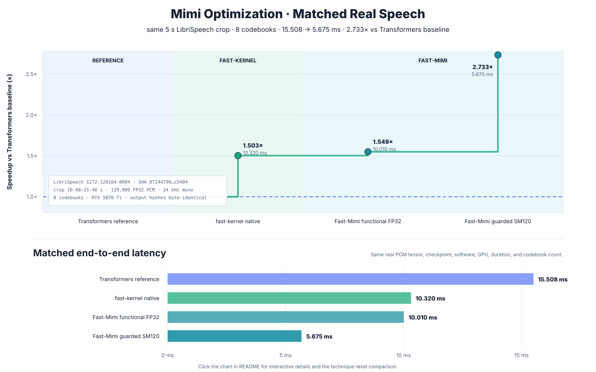

# Fast-Mimi

Fast-Mimi is a Transformers-free PyTorch inference runtime for
[Kyutai Mimi](https://huggingface.co/kyutai/mimi), optimized for RTX 5070 Ti
(SM120) with CUDA Graphs, Triton, cuDNN, CUDA, and CUTLASS.

## Optimization overview

[](docs/optimization-comparison.html)

_Click the chart for the interactive report, experiment tooltips, and the full
technique comparison. Its visual structure follows the
[AutoKernel progress view](https://github.com/RightNow-AI/autokernel/blob/main/progress.png)._

The comparison now uses only one matched real-speech workload. Both repositories
receive the same hash-pinned LibriSpeech crop, exact checkpoint revision, FP32
PCM tensor, five-second duration, eight codebooks, GPU, PyTorch, and CUDA stack.
Only the matched real-speech measurements are included in the chart.

| Matched implementation | Median latency | vs. Transformers reference |
|---|---:|---:|
| Transformers `kyutai/mimi` reference | 15.508 ms | 1.0000x |
| [fast-kernel](https://github.com/kadirnar/fast-kernel) native candidate | 10.320 ms | 1.5028x |
| Fast-Mimi functional FP32 reference | 10.010 ms | 1.5492x |
| Fast-Mimi guarded SM120 runtime | **5.675 ms** | **2.7327x** |

The cross-repository rows above are cross-session medians, not a paired
confidence interval. Within each repository, 50 alternating pairs measured
paired medians of `1.5012x` for fast-kernel and `1.7786x` for Fast-Mimi;
Fast-Mimi's 95% paired bootstrap interval was `1.7581x–1.7992x`.

| Dimension | fast-kernel native candidate | Fast-Mimi production runtime |
|---|---|---|
| Fixed input | LibriSpeech `1272-128104-0004`, SHA-256 `07244790…c5404`, 10.48–15.48 s crop | The identical 120,000-sample tensor |
| Model contract | Frozen `kyutai/mimi` revision `89091b3e…`, FP32, 8 codebooks | The same checkpoint, revision, precision, and codebook count |
| Accepted path | Transformers-owned weights with a native functional PyTorch adapter | Inductor, Triton, cuDNN Frontend, segmented/fixed-pointer CUDA Graphs, CUDA/CUTLASS/WMMA |
| Output proof | Codes and waveform byte-identical to Transformers | The same code SHA-256 `6cea0662…26ec` and waveform SHA-256 `3de82c42…9840` |
| Deployment scope | Current benchmark adapter | Guarded SM120 5/10/100-second paths with portable PyTorch fallback |

The 5-, 10-, and 100-second labels in this README are **input audio durations**,
not benchmark wall-clock budgets.

## End-to-end results

Measurements use an RTX 5070 Ti (SM120), 24 kHz mono audio, eight codebooks,
and exact five-, ten-, or 100-second inputs. The first call is excluded. Only
accepted production optimizations are listed.

These historical tables come from their recorded sessions. The matched
real-speech comparison above is the current reproducible cross-repository gate.

### 5-second audio

| Method | Latency | Speedup | Real-time Factor |
|---|---:|---:|---:|
| Pure PyTorch FP32 | 10.033 ms | 1.0000x | 498x |
| Inductor SEANet | 9.313 ms | 1.0772x | 537x |
| Exact short-form runtime | 5.546 ms | 1.8089x | 901x |
| + packed QKV | 5.478 ms | 1.8314x | 913x |
| Published Fast-Mimi API | **5.497 ms** | **1.8251x** | **910x** |

### 10-second audio

| Method | Latency | Speedup | Real-time Factor |
|---|---:|---:|---:|
| Pure PyTorch FP32 | 12.644 ms | 1.0000x | 791x |
| Inductor SEANet | 10.653 ms | 1.1869x | 939x |
| Exact short-form runtime | 9.260 ms | 1.3654x | 1,080x |
| Published Fast-Mimi API | **9.276 ms** | **1.3631x** | **1,078x** |

### 100-second audio

The optimization-history rows below belong to one measurement session and use
the `135.667 ms` reference in the first row. A newer paired gate is reported
separately because its matching reference was `133.561 ms`; mixing that row into
this table would make its speedup denominator ambiguous.

| Method | Latency | Speedup | Real-time Factor |
|---|---:|---:|---:|
| Independent pure PyTorch reference | 135.667 ms | 1.0000x | 737x |
| Inductor + CUDA Graph + Triton/cuDNN base package | 65.848 ms | 2.0603x | 1,519x |
| Quality-safe RVQ + cuDNN plan recovery | 62.235 ms | 2.1800x | 1,607x |
| Native CUTLASS decoder-11 | 62.235 ms | 2.1800x | 1,607x |
| cuDNN + WMMA decoder-9 and native final-post | 60.878 ms | 2.2299x | 1,643x |
| Selected WMMA decoder-12/final | 59.956 ms | 2.2628x | 1,668x |
| Packed QKV, bit-equivalent RoPE, fixed-pointer graphs, and autotuning | 59.636 ms | 2.2744x | 1,677x |
| Published independent Fast-Mimi API | 59.881 ms | 2.2656x | 1,670x |

#### Latest frozen paired gate (separate session)

| Paired measurement | Median latency | Speedup | 95% bootstrap CI | Real-time Factor |
|---|---:|---:|---:|---:|
| Pure PyTorch reference | 133.561 ms | 1.0000x | — | 749x |
| Fast-Mimi candidate | **58.916 ms** | **2.2669x** | **2.2638x–2.2852x** | **1,697x** |

This gate used the same fixed 100-second input for 50 alternating
reference/candidate pairs and 10,000 bootstrap resamples. The frozen quality
gate passed 20/20 inputs with zero code mismatches; its worst tolerance ratio
was `0.887200` and maximum absolute waveform difference was `0.000197440`
(`atol=2e-4`, `rtol=1e-4`).

### Hash-pinned real-speech recheck (2026-08-19)

This recheck uses LibriSpeech row `1272-128104-0004` from the pinned
[`hf-internal-testing/librispeech_asr_dummy`](https://huggingface.co/datasets/hf-internal-testing/librispeech_asr_dummy)
revision. The source FLAC SHA-256 is
`07244790e9a8300bfcbf12c28ac5230792e75238d03b2ac167a72bf3943c5404`.
It is resampled from 16 kHz to 24 kHz, then seed 1103 selects the frame-aligned
crop beginning at sample 251,520 (10.48 seconds). The five-second input is the
exact prefix of the ten-second input. Every call uses eight codebooks, includes
output materialization, synchronizes CUDA, and excludes compile/autotune warmup.
Each result contains 50 alternating pairs and 10,000 bootstrap resamples.

| Audio | Pure PyTorch reference | Fast-Mimi | Paired median speedup | 95% paired CI | Quality |
|---:|---:|---:|---:|---:|---|
| 5 s | 10.010 ms | 5.675 ms | 1.7786x | 1.7581x–1.7992x | Codes 0, waveform violations 0 |
| 10 s | 12.961 ms | 9.587 ms | 1.3550x | 1.3443x–1.3643x | Codes 0, waveform violations 0 |
| 5 s target | — | ≤2.002 ms | 5.0000x | — | Same frozen contract required |
| 10 s target | — | ≤2.592 ms | 5.0000x | — | Same frozen contract required |

The guarded Fast-Mimi output is byte-identical to the Transformers result on
this input: code SHA-256 `6cea0662…26ec`, waveform SHA-256 `3de82c42…9840`.

#### Earlier generated-waveform optimization audit

The attempts below predate the real-speech correction and used the deterministic
seed-1103 100-second generated waveform. They remain recorded as optimization
history but are excluded from the matched graph and table above.

| Attempt | 100-second evidence | Accuracy | Decision |
|---|---|---|---|
| Three/four-term compensated FP16 encoder convolution | Three terms: 9.089 → 8.150 ms component; four terms: 9.193 → 9.586 ms | 31/35 code mismatches | Rejected |
| Single fused SM120 compensated WMMA encoder kernel | 9.184 → 10.440 ms component | 28 code mismatches | Rejected |
| Exact `im2col + SGEMM` encoder rewrite | 9.136 → 3.997 ms eager microtest, but 60.048 → 61.008 ms end to end | Codes exact; waveform gate passed | Rejected: end-to-end regression |
| Exact stride-6/stride-8 `im2col` encoder rewrites | 60.109/60.070 ms end to end | Codes exact; waveform gate passed | Rejected: no gain |
| Expanded decoder-12/final tile sweep | Tail 2.222 → 2.095 ms; paired 59.960 → 59.880 ms | Bit-exact; 1.0024x, 95% CI 0.9983x–1.0055x | Rejected: not significant |
| Expanded decoder-9 launch sweep | Existing 0.8209 ms launch remained fastest | Every variant bit-exact | Rejected: no faster variant |
| Single-kernel local FlexAttention | Attention 0.202 → 0.441 ms; end to end 59.893 → 64.206 ms | 11 code mismatches, 162,506 waveform violations | Rejected |
| ATen-locked compiled encoder+decoder transformers | End to end 58.146 ms | 5 code mismatches, 45,988 waveform violations | Rejected |
| One-layer compiled transformer scan | Encoder: every layer changed 3–11 codes; decoder: every layer caused 6–14 violations | Frozen gate failed for all 16 cases | Rejected |
| Split compiled attention/MLP | Attention 1.0442 → 1.0407 ms and exact; MLP 11 violations | Attention gain negligible; MLP failed | Rejected |
| Custom first encoder convolution | cuDNN 0.936 ms; fastest Triton 1.100 ms | Triton was not bit-exact | Rejected: slower and inaccurate |
| Wider encoder Inductor autotune | Baseline 60.651; coordinate 60.555, flexible 60.591, no-padding 60.596 ms | Exact output | Rejected: practical/statistical gain absent |
| Encoder 1×1 convolution-to-GEMM | 61.023 ms | 45 code mismatches, 692,019 waveform violations | Rejected |
| Decoder-only compiled transformer | 59.698 ms | Codes exact; 9 waveform violations | Rejected |

Install the `audio` and `optimized` extras, then reproduce the fixed-input table
with the same hash-pinned FLAC:

```bash
PYTHONPATH=src HF_HUB_OFFLINE=1 .venv/bin/python \
  benchmarks/benchmark_fixed.py --audio-seconds 5 10 --pairs 50 \
  --audio-file /path/to/1272-128104-0004.flac
```

## Installation

Portable PyTorch runtime:

```bash
pip install "fast-mimi @ git+https://github.com/kadirnar/fast-mimi.git"
```

RTX 5070 Ti/SM120 optimized runtime:

```bash
pip install "fast-mimi[optimized] @ git+https://github.com/kadirnar/fast-mimi.git"
```

## Usage

```python
import torch

from fast_mimi import MimiModel

device = torch.device("cuda" if torch.cuda.is_available() else "cpu")
model = MimiModel.from_pretrained(device=device)

audio = torch.randn(1, 1, 2_400_000, device=device) * 0.05
padding_mask = torch.ones_like(audio, dtype=torch.bool)

with torch.inference_mode():
    output = model(audio, padding_mask=padding_mask, num_quantizers=8)

print(output.audio_codes.shape)
print(output.audio_values.shape)
```

Other shapes, streaming calls, CPU execution, and non-SM120 GPUs use the
portable PyTorch path. The optimized path was validated with PyTorch
`2.13.0+cu130`, Triton `3.7.1`, cuDNN frontend `1.27.0`, CUDA 13, and SM120.

## License

Fast-Mimi is licensed under [Apache-2.0](LICENSE). The `kyutai/mimi` weights
are distributed separately under CC-BY-4.0.
