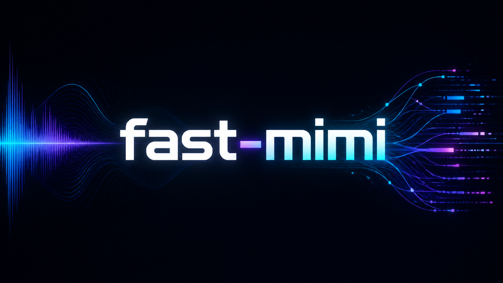

# Fast-Mimi

Fast-Mimi is a Transformers-free PyTorch inference runtime for
[Kyutai Mimi](https://huggingface.co/kyutai/mimi), optimized for RTX 5070 Ti
(SM120) with CUDA Graphs, Triton, cuDNN, CUDA, and CUTLASS.

The [interactive optimization report](docs/optimization-comparison.html) shows
the accepted/rejected search trajectory in an AutoKernel-style progress view
and compares the optimization stack with the separate fast-kernel campaign.

## End-to-end results

Measurements use an RTX 5070 Ti (SM120), 24 kHz mono audio, eight codebooks,
and exact five-, ten-, or 100-second inputs. The first call is excluded. Only
accepted production optimizations are listed.

### 5-second audio

| Method | Latency | Speedup | Real-time Factor |
|---|---:|---:|---:|
| Pure PyTorch FP32 | 10.033 ms | 1.0000x | 498x |
| Inductor SEANet | 9.313 ms | 1.0772x | 537x |
| Exact short-form runtime | 5.546 ms | 1.8089x | 901x |
| + packed QKV | 5.478 ms | 1.8314x | 913x |
| Published Fast-Mimi API | **5.497 ms** | **1.8251x** | **910x** |

### 10-second audio

| Method | Latency | Speedup | Real-time Factor |
|---|---:|---:|---:|
| Pure PyTorch FP32 | 12.644 ms | 1.0000x | 791x |
| Inductor SEANet | 10.653 ms | 1.1869x | 939x |
| Exact short-form runtime | 9.260 ms | 1.3654x | 1,080x |
| Published Fast-Mimi API | **9.276 ms** | **1.3631x** | **1,078x** |

### 100-second audio

| Method | Latency | Speedup | Real-time Factor |
|---|---:|---:|---:|
| Independent pure PyTorch reference | 135.667 ms | 1.0000x | 737x |
| Inductor + CUDA Graph + Triton/cuDNN base package | 65.848 ms | 2.0603x | 1,519x |
| Quality-safe RVQ + cuDNN plan recovery | 62.235 ms | 2.1800x | 1,607x |
| Native CUTLASS decoder-11 | 62.235 ms | 2.1800x | 1,607x |
| cuDNN + WMMA decoder-9 and native final-post | 60.878 ms | 2.2299x | 1,643x |
| Selected WMMA decoder-12/final | 59.956 ms | 2.2628x | 1,668x |
| Packed QKV, bit-equivalent RoPE, fixed-pointer graphs, and autotuning | 59.636 ms | 2.2744x | 1,677x |
| Published independent Fast-Mimi API | 59.881 ms | 2.2656x | 1,670x |
| Latest frozen paired benchmark | **58.916 ms** | **2.2669x** | **1,697x** |

## Installation

Portable PyTorch runtime:

```bash
pip install "fast-mimi @ git+https://github.com/kadirnar/fast-mimi.git"
```

RTX 5070 Ti/SM120 optimized runtime:

```bash
pip install "fast-mimi[optimized] @ git+https://github.com/kadirnar/fast-mimi.git"
```

## Usage

```python
import torch

from fast_mimi import MimiModel

device = torch.device("cuda" if torch.cuda.is_available() else "cpu")
model = MimiModel.from_pretrained(device=device)

audio = torch.randn(1, 1, 2_400_000, device=device) * 0.05
padding_mask = torch.ones_like(audio, dtype=torch.bool)

with torch.inference_mode():
    output = model(audio, padding_mask=padding_mask, num_quantizers=8)

print(output.audio_codes.shape)
print(output.audio_values.shape)
```

Other shapes, streaming calls, CPU execution, and non-SM120 GPUs use the
portable PyTorch path. The optimized path was validated with PyTorch
`2.13.0+cu130`, Triton `3.7.1`, cuDNN frontend `1.27.0`, CUDA 13, and SM120.

## License

Fast-Mimi is licensed under [Apache-2.0](LICENSE). The `kyutai/mimi` weights
are distributed separately under CC-BY-4.0.
